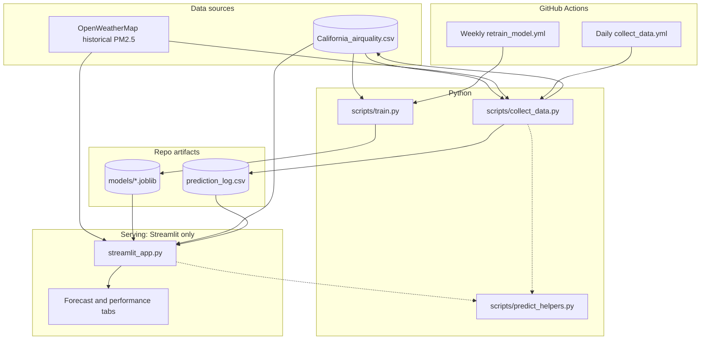

# AQI Forecasting System — Santa Clara County (ML + MLOps)

An end-to-end machine learning application that predicts **daily Air Quality Index (AQI)** for **Santa Clara County, California**. It goes beyond a one-off model: it includes **feature engineering**, **serialized models**, **live inference data** from OpenWeatherMap, and **scheduled automation** (GitHub Actions) for data updates and retraining.

**Live demo:** https://ls-aqi-predictor.streamlit.app/  
**Repository:** https://github.com/LakshyaShrivastava/AQI-Predictor-app

---

## Problem

Air quality affects health and daily decisions, but **short-horizon, location-specific** forecasts are not always easy to interpret or compare to recent conditions. This project delivers a **7-day daily AQI forecast** grounded in **recent history**, with an optional comparison between models trained with different historical coverage (including extreme wildfire periods).

---

## System architecture (as implemented)




**How to read it**

- **Solid arrows** are data or runtime flow (files, API calls, loads). **Dotted arrows** mean *imports*: `collect_data.py` and `streamlit_app.py` call `predict_helpers.py` for PM2.5→AQI and feature rows; `train.py` builds the same feature *shape* inline for training.  
- **Training path:** `train.py` reads the county time series from the CSV, builds lag + rolling features, fits `RandomForestRegressor`, writes `model_santa_clara_fire_aware.joblib`.  
- **Daily automation:** `collect_data.py` uses OWM + the fire-aware model to append **yesterday’s actual** to the CSV and a **prediction row** to `prediction_log.csv` (when the workflow runs and secrets are set).  
- **Interactive app:** `streamlit_app.py` loads a chosen `.joblib`, pulls the last seven days from OWM (cached), builds the same feature row, then **recursively** predicts seven future days — no FastAPI layer in between.

**Components in this repo**

| Piece | What it does |
|--------|----------------|
| **Data** | `California_airquality.csv` — historical daily records; extended daily by `scripts/collect_data.py` when automation runs. |
| **Features** | Seven **lag** values of daily AQI plus **rolling mean and standard deviation** over the same 7-day window (aligned with `scripts/train.py` and `scripts/predict_helpers.py`). |
| **Inference** | Streamlit loads a `.joblib` model, pulls recent days via **OpenWeatherMap Air Pollution API**, converts **PM2.5 → U.S. EPA AQI**, then **recursively** forecasts seven days ahead. |
| **Automation** | GitHub Actions: **daily** data collection / prediction logging; **weekly** retraining of the fire-aware model. Artifacts are committed back to the repo when they change. |

There is **no separate REST service** in this repository; the **Streamlit app is the serving layer**. A small FastAPI (or similar) wrapper is a natural extension if you need non-browser clients.

---

## Models in the UI

You can switch models in the sidebar to illustrate **how training data shapes behavior**:

| Artifact | Role |
|----------|------|
| `model_santa_clara_fire_aware.joblib` | Primary model, retrained on the growing dataset (including severe 2020 smoke when present in the CSV). Updated on the weekly schedule. |
| `model_2020.joblib` | Baseline / comparison model (earlier “normal period” training story in the app). |

**Model family:** `RandomForestRegressor` (**scikit-learn**) — strong default for **tabular** lag + rolling features, tolerant of noise, and simpler to operate than deep sequence models at this data scale.

---

## Feature engineering (accurate to code)

- **Lags:** `DAILY_AQI_VALUE_lag_1` … `lag_7` from the prior seven **daily** values.  
- **Rolling stats:** mean and standard deviation over that same window (training uses shifted windows so the target day is not leaked into its own rolling stats).  
- **Live path:** historical **PM2.5** from OpenWeatherMap, averaged to a daily value, then mapped to **EPA AQI** for consistency with the index the model was trained on.

The README’s “multi-pollutant + hourly” story would be a **future** extension; the shipped pipeline is **daily AQI + PM2.5-backed recent history**.

---

## Evaluation and training (honest scope)

- **`scripts/train.py`** fits on **all** available rows after feature construction and writes the fire-aware artifact. It does **not** currently export hold-out **RMSE / R²** or a baseline comparison to the repository.  
- **`prediction_log.csv`** supports a **simple retrospective view** in the app (logged predictions merged with county actuals) when the log and dataset are present.

**Talking point for interviews:** the next “product-grade” step is **time-based validation** (walk-forward or rolling-origin splits) and storing **metrics + data snapshot IDs** next to each model version.

---

## MLOps and automation

- **Daily workflow** (`.github/workflows/collect_data.yml`): runs `scripts/collect_data.py` with `OWM_API_KEY` from repository secrets; appends yesterday where appropriate and updates the prediction log.  
- **Weekly workflow** (`.github/workflows/retrain_model.yml`): runs `scripts/train.py` and commits the updated `model_santa_clara_fire_aware.joblib` when it changes.

This is **scheduled automation and versioning via git**, not a full enterprise CI/CD pipeline (no PR-gated test suite or multi-environment deploy described here).

---

## Engineering highlights

- Shared **feature contract** between training and inference (`create_time_series_features` in training vs `create_features_for_prediction` for inference).  
- **Caching** in Streamlit for model load and API-backed history.  
- **Secrets:** OpenWeatherMap key via Streamlit secrets locally and GitHub Actions secrets in automation.

---

## Challenges and tradeoffs

- **Recursive multi-step forecast** — errors can compound; common tradeoff for simple autoregressive setups.  
- **Data source mix** — training history comes from the **EPA-style** county dataset; live features use **OWM**; a production system would monitor **bias/drift** between sources.  
- **Git as artifact store** — fine for a portfolio / small team; larger teams usually move datasets and models to **object storage** with explicit versioning (DVC, MLflow, etc.).

---

## Future improvements

- Time-based **validation** and reported metrics checked into the repo (or MLflow).  
- **Uncertainty** (e.g. quantile regression forest or conformal intervals).  
- **SHAP** or partial dependence for interpretability.  
- **Gradient boosting** (XGBoost / LightGBM) as an alternative tabular model.  
- **FastAPI + Docker** if you need a proper API and horizontal scaling.  
- Richer features only when justified: **multi-pollutant**, **meteorology**, or **seasonality** — with leakage checks and source licensing reviewed.

---

## Running locally

**Prerequisites:** Python **3.9+**, Git.

```bash
git clone https://github.com/LakshyaShrivastava/AQI-Predictor-app.git
cd AQI-Predictor-app
python -m venv venv
```

Activate the venv:

- **Windows (PowerShell):** `.\venv\Scripts\activate`  
- **macOS / Linux:** `source venv/bin/activate`

```bash
pip install -r requirements.txt
```

**OpenWeatherMap API key**

1. Create a folder `.streamlit` in the project root.  
2. Add `.streamlit/secrets.toml`:

```toml
OWM_API_KEY = "your_key_here"
```

**Start the app**

```bash
streamlit run streamlit_app.py
```

Ensure `models/` contains the `.joblib` files referenced in the app (or train with `python scripts/train.py` after the dataset is present).

---

## Key takeaways

- End-to-end **tabular time-series** forecasting with **explicit lag + rolling features**.  
- **Operational loop**: scheduled refresh of data and periodic retraining, surfaced in a **Streamlit** deployment.  
- Clear path to **hardening**: held-out metrics, drift checks, and API-first serving.

---

## Author

**Lakshya Shrivastava** — Computer Science @ UC Irvine  

- GitHub: https://github.com/LakshyaShrivastava  
- LinkedIn: https://www.linkedin.com/in/lakshya-shrivastava0803  
